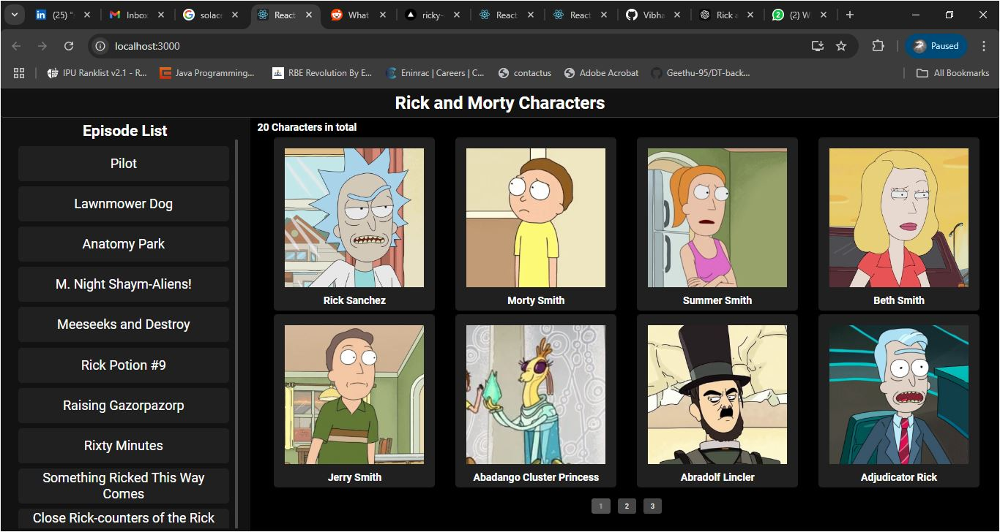
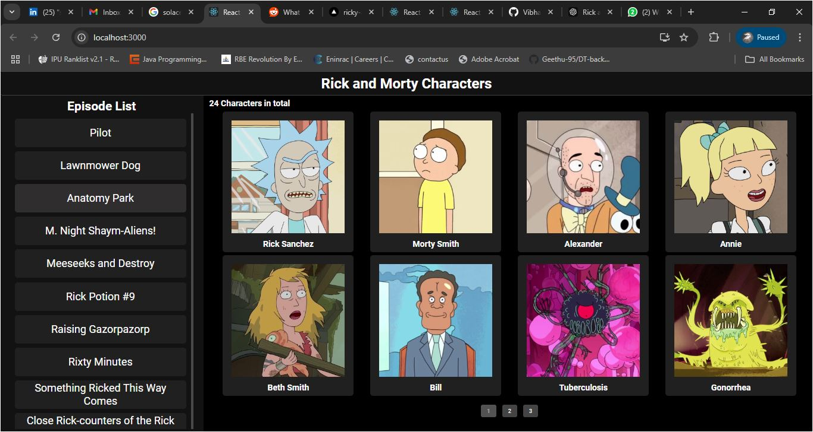

Rick and Morty Image Feed

This project is a React and TypeScript application that displays episodes and character images from the Rick and Morty API. Users can select an episode from the sidebar, which will display the associated characters in the main view. The project also includes styled components and a responsive layout for a smooth user experience.

Table of Contents

Technologies Used
Installation
Running the Project
Features
API Documentation
Screenshots
License

Technologies Used

React with TypeScript for the frontend framework
Axios for API requests
Tailwind CSS or Bootstrap (optional) for styling
Rick and Morty API for episode and character data

Installation

Clone the Repository

git clone <repository-url>
cd <repository-directory>

Install Dependencies

npm install

Running the Project

Start the Development Server

npm start
Open http://localhost:3000 in your browser to view the application.

Features

Episode Selection:

A sidebar displays a list of episodes from the Rick and Morty API.
Clicking an episode highlights it and displays its characters.
Character Display:
Displays character images and names for the selected episode.
Dynamic Styling:
Selected episode is visually highlighted for easy navigation.
Responsive layout with CSS Grid and Flexbox.

API Documentation

This project uses the public Rick and Morty API to fetch episode and character data.
Episodes: /api/episode – Fetches list of episodes.
Characters by Episode: /api/character – Fetches character data for each selected episode.

# Screenshots

1. **Initial Page Load**:

   - Displays the episode list on the left.

   

2. **Episode Selected**:

   - Shows character images and names on the main view.

   

License
This project is open-source and available under the MIT License.
